# ferrite-ui

Bare-metal HMI framework written in Rust. Originally built for the Nextion NX8048K070 display (GD32F103 / Cortex-M3); now also supports e-paper displays on ESP32-S3.

For some bricked Nextion displays :)

## Hardware

### Nextion / GD32F103 target

| Component | Part | Details |
|-----------|------|---------|
| CPU | GD32F103RBT6 | Cortex-M3, 108MHz, 128KB Flash, 20KB RAM |
| Display | NX8048K070 | 800x480 TFT LCD |
| Display controller | FPGA | 2MB framebuffer, double-buffered, CPU writes directly |
| Touch | XPT2046 | SPI, Z-pressure detection, median filter |
| Flash | W25Q256JVFQ | 32MB SPI, stores fonts/images/bytecode |
| RTC | AT8563T | I2C |

### E-paper / ESP32-S3 target

| Component | Part | Details |
|-----------|------|---------|
| CPU | ESP32-S3 | Xtensa LX7, 240MHz, built-in flash |
| Display | ED047TC1 | 960x540 e-paper (4.7", E Ink) |
| Interface | RMT peripheral | Pixel-parallel output via ESP32-S3 RMT |
| Flash filesystem | XIP embedded | `ferrite_fs.bin` linked into binary at build time |

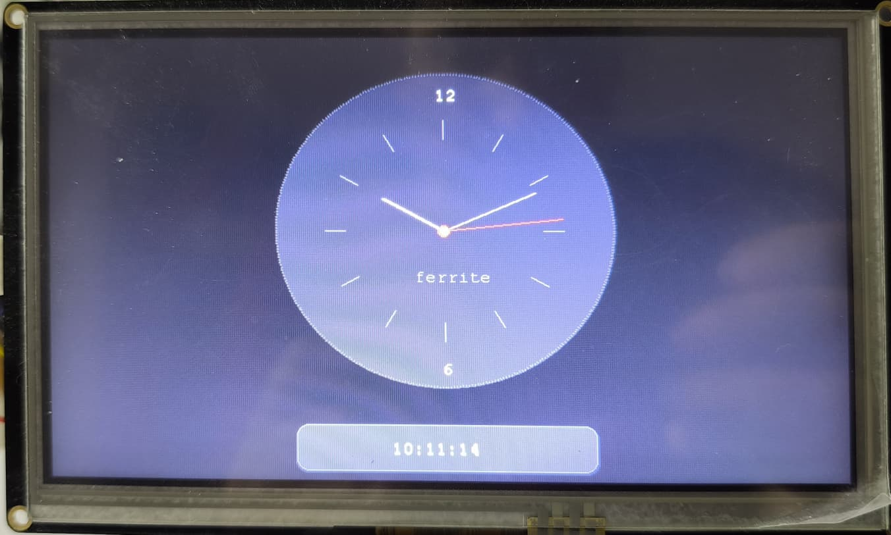

### ST-Link SWD Pinout

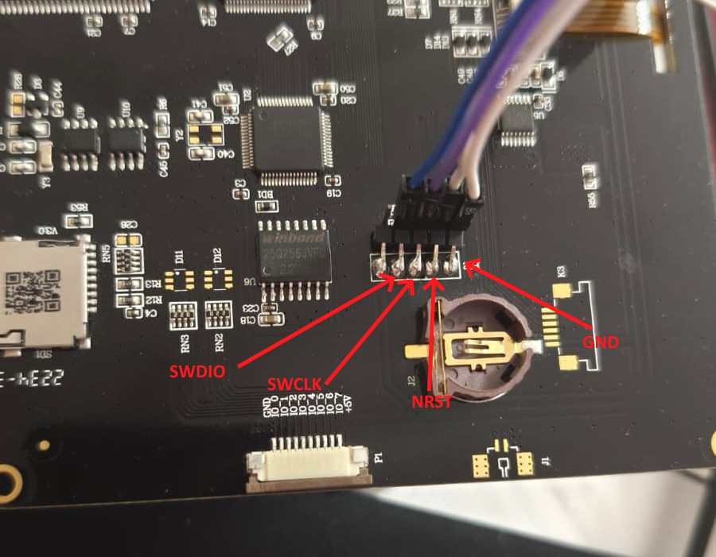

## Features

- **Widget system** -- HTML-like tree structure with CSS box model, split-struct design (20B base + 36B extension on demand)
- **Widget types** -- Base (container), Label, Button, Progress, Slider, Checkbox, Radio, Text Input, Gauge, Dropdown
- **Dirty redraw** -- Two-pass clip-based painter's algorithm (erase hidden, then draw visible)
- **Double buffering** -- FPGA back/front buffer swap, dual-buffer dirty tracking (only changed widgets redrawn per buffer)
- **E-paper render mode** -- Dirty partial-update path with `flush_dirty()` for ED047TC1 panels (no tearing, driven via RMT)
- **Bytecode VM** -- 100+ opcode values, stack-based locals (FRAME prologue), globals, callbacks, arrays, strings, float32, and an 8-deep call stack
- **Drawing primitives** -- fillRect, rect, line, circle, fillCircle, roundedRect, fillRoundedRect, arc, drawImage, drawText
- **Float32 arithmetic** -- Software float (add/sub/mul/div/neg + comparisons + conversion)
- **Float math functions** -- `sin`, `cos`, `sqrt`, `abs`, `atan2`, `floor`, `ceil` (via `libm`, all in radians)
- **`sprintf` builtin** -- printf-style string formatting (`%d`, `%f`, `%x`, `%s`, `%02d`, `%.2f`, …), zero-heap output
- **String pool** -- Heap-allocated strings with auto-incrementing IDs, smart GC preserving widget text
- **Touch input** -- Debounced press/hold/release events, hit testing, on_click and on_tap callbacks, on-screen keyboard
- **Scrollable containers** -- FLAG_CLIP_CHILDREN on any widget, scrollbar, virtual rendering (off-screen children skipped)
- **Custom paint** -- on_paint callback for widget custom drawing
- **Flash filesystem** -- TOC-based, named resources (fonts, images, programs, pages, files); XIP-embedded on ESP32
- **Font rendering** -- Adafruit GFX compatible bitmap fonts (flash + embedded)
- **Image format** -- Ferrite Image (FI): raw/RLE/indexed+RLE, streaming decode
- **Recovery mode** -- Hold top-left corner 3s at boot for USART-only reflash mode (see below)
- **USART protocol** -- Protobuf-style serial communication (ping, execute, flash write, user messages)
- **Backlight PWM** -- 0-100% brightness via hardware timer
- **SysTick timer** -- 1ms tick counter, blocking and non-blocking delays
- **Hardware watchdog** -- Auto-reset on hang; fed every main-loop iteration
- **Debug symbols** -- Compiler emits `.dbg` sidecar (variable names, function names) for disassembler and designer

### Recovery Mode

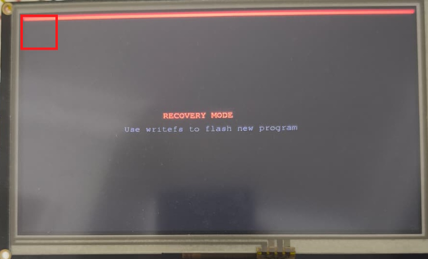

Hold the top-left corner for 3 seconds at boot. A red progress bar fills while holding. Release to cancel. In recovery mode, no program is loaded -- use `writefs` via USART to flash a new program.

### Widget Demo

| Buttons | Sliders |
|---------|---------|
| 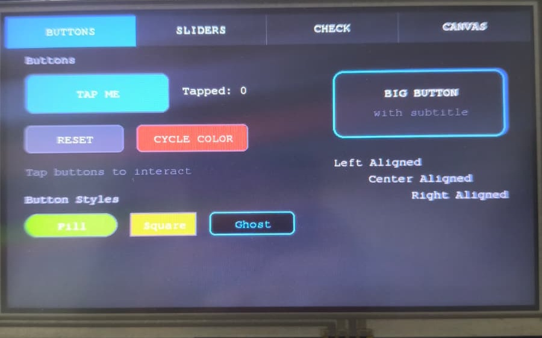 | 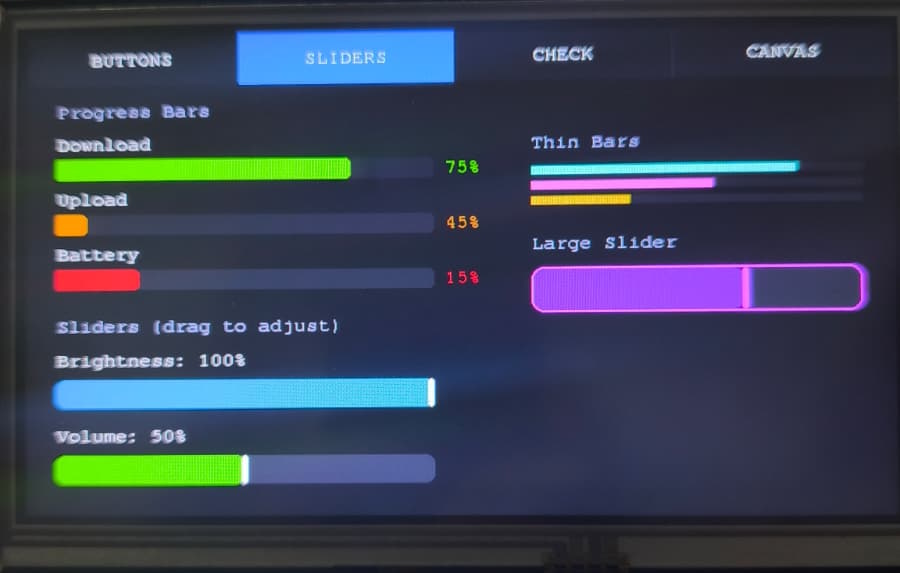 |

| Checkbox / Radio | Canvas (on_paint) |
|------------------|-------------------|
| 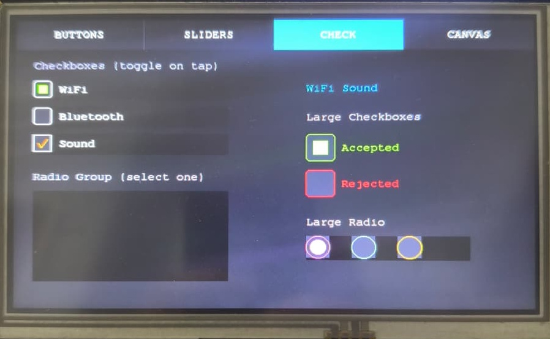 | 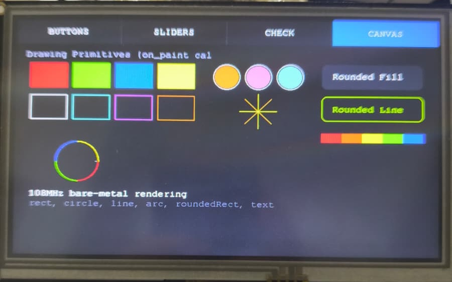 |

| Brick Breaker | Gradient Fill |
|---------------|---------------|
| 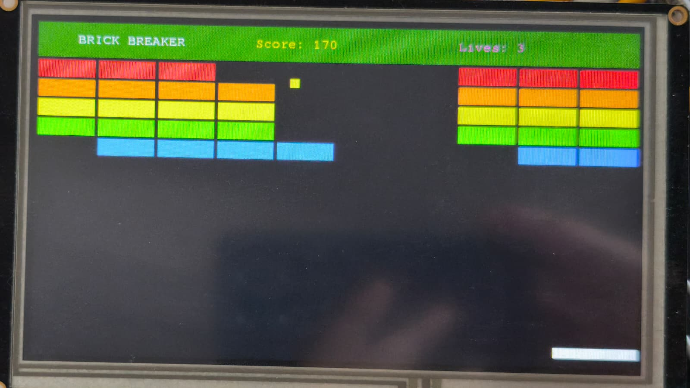 | 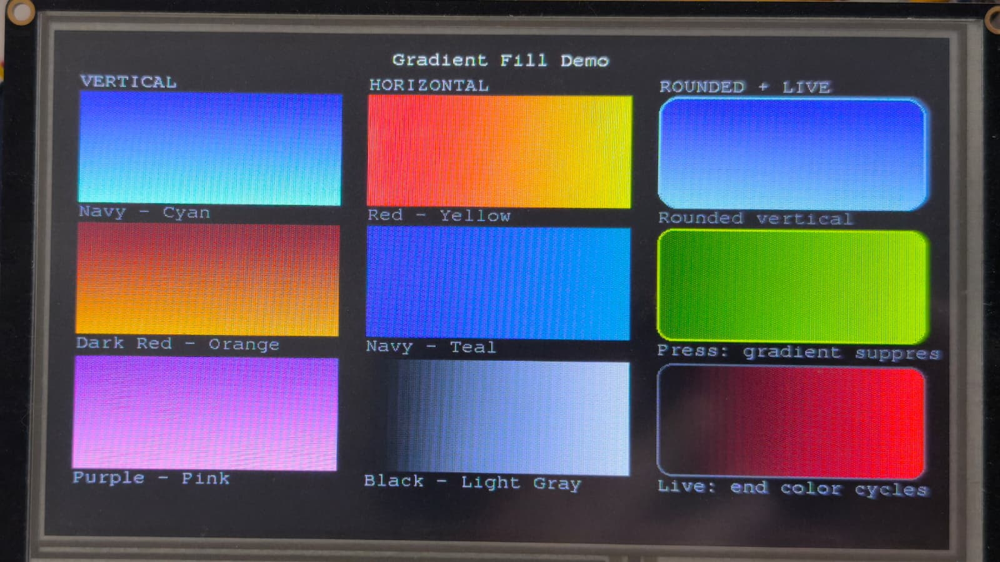 |

### New Components

| Gauge | Scroll List | Text Input + Keyboard |
|-------|-------------|----------------------|
| 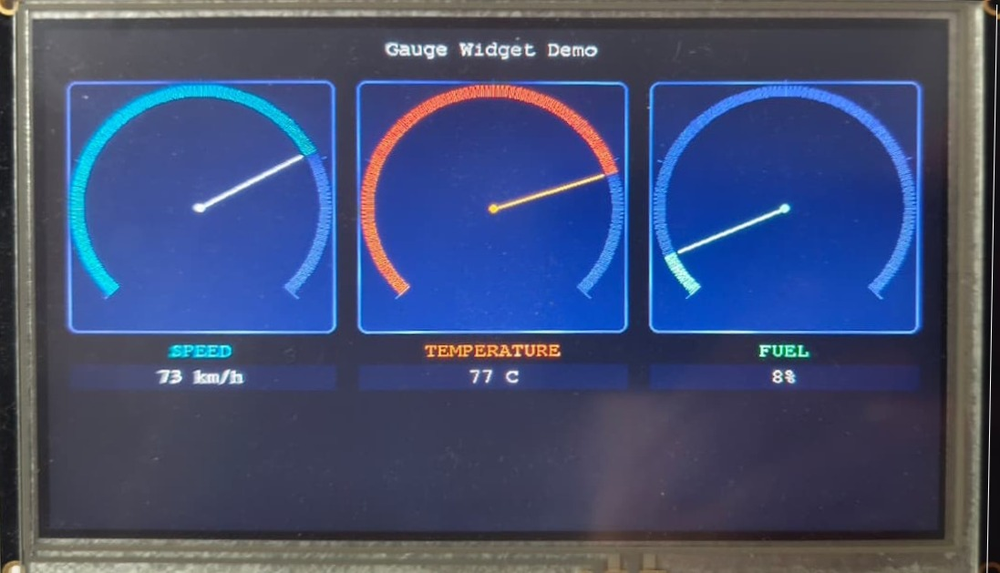 | 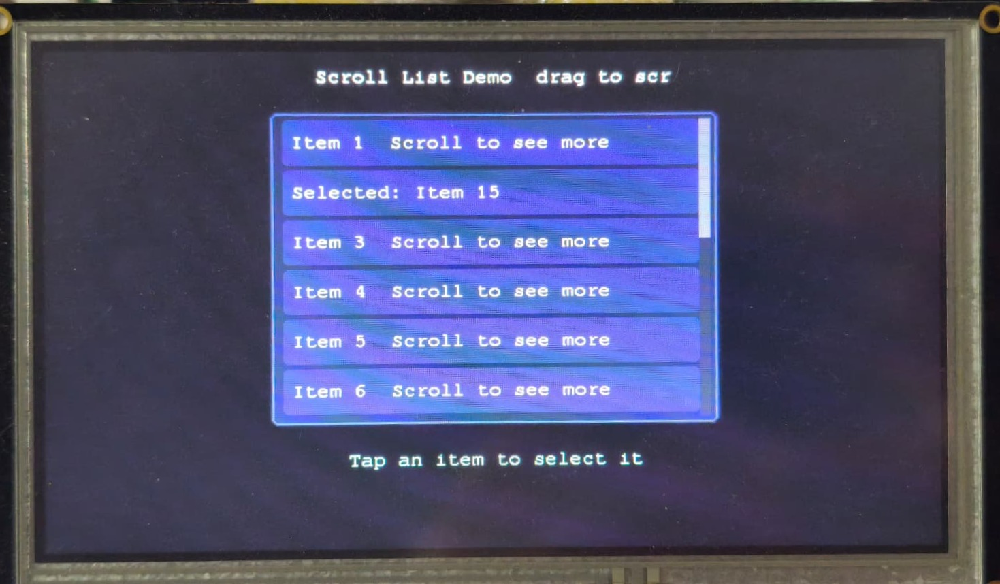 | 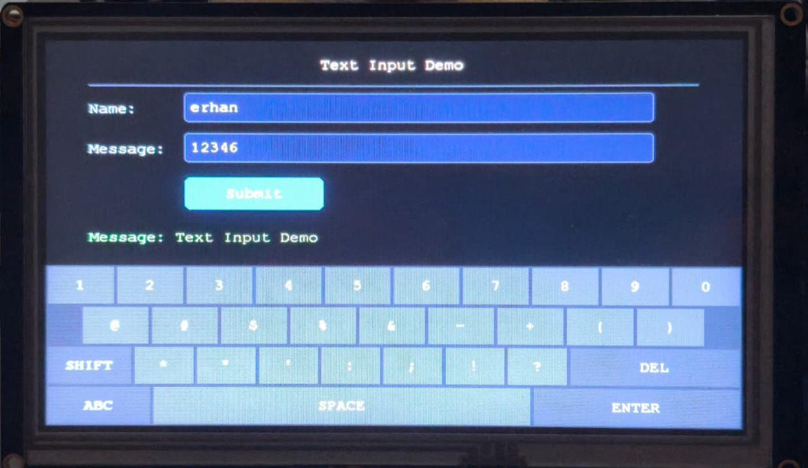 |

Example projects live under [examples/](examples/), including clock, widget demo, touch test, brick breaker, gradient demo, gauge, scroll list, text input, printer menu, and dropdown demos.

## Ferrite Language

Programs are written in a C-like language (`.fl` files) that compiles to VM bytecode. New math functions (`sin`, `cos`, `atan2`, `sqrt`, `abs`, `floor`, `ceil`) and `sprintf` are available as builtins. Here's an [analog clock](examples/clock/standalone.fl) that demonstrates drawing primitives, string operations, and the animation loop:

```c
// Hand positions: 12 entries (R=120), dx = R*sin(i*30°)
var sdx[12] = [0, 60, 104, 120, 104, 60, 0, -60, -104, -120, -104, -60];
var sdy[12] = [-120, -104, -60, 0, 60, 104, 120, 104, 60, 0, -60, -104];

var h = 10;
var m = 10;
var s = 0;

// Clock face
fillCircle(400, 210, 170, 0x2945);
arc(400, 210, 170, 0, 359, 0x4A69);
drawText(392, 68, 0, 0xFFFF, 0, "12");

// Digital time panel
fillRoundedRect(250, 420, 300, 50, 12, 0x2945);
roundedRect(250, 420, 300, 50, 12, 0x4A69);

while (true) {
    // Second hand (red)
    var i = s / 5;
    line(400, 210, 400 + sdx[i], 210 + sdy[i], 0xF800);

    // Center dot
    fillCircle(400, 210, 6, 0xF800);
    fillCircle(400, 210, 3, 0xFFFF);

    // Digital time "HH:MM:SS"
    var ts = concat(itos(h), concat(str(":"),
             concat(itos(m), concat(str(":"), itos(s)))));
    drawStr(345, 450, 0, 0xFFFF, 0, ts);
    strClear();  // free temp strings, widget text preserved

    delay(1000);
    s = s + 1;
    if (s >= 60) { s = 0; m = m + 1; }
    if (m >= 60) { m = 0; h = h + 1; }
    if (h >= 24) { h = 0; }
}
```

See [docs/ferrite-lang.md](docs/ferrite-lang.md) for the full language reference and [examples/](examples/) for complete programs.
See [docs/protocol.md](docs/protocol.md) for the USART protocol reference used by `tools/ferrite_cli.py`.
See [docs/bytecode.md](docs/bytecode.md) for the VM image format, opcode, and widget property reference.

## Toolchain

```bash
# Compile .fl source to bytecode
python tools/ferrite_lang.py program.fl -o program.bin

# Disassemble bytecode
python tools/ferrite_cc.py disasm program.bin

# Upload and execute on device
python tools/ferrite_cli.py -p COM3 execute program.bin

# Write flash filesystem image
python tools/ferrite_cli.py -p COM3 writefs flash.bin

# Send user message to device
python tools/ferrite_cli.py -p COM3 send 0x01 0x02 0x03

# Convert PNG to Ferrite Image format
python tools/ferrite_img.py icon.png -o icon.fi

# Analyze bytecode memory and instruction profile
python tools/ferrite_analyze.py program.fl -v
```

## Building

Requires Rust 1.85+ (2024 edition).

### GD32F103 (Nextion / firmware)

```bash
rustup target add thumbv7m-none-eabi
rustup component add llvm-tools-preview
cargo install cargo-binutils

cargo build --release --features firmware --target thumbv7m-none-eabi
cargo objcopy --release --features firmware --target thumbv7m-none-eabi --bin ferrite-ui -- -O binary firmware.bin

# flash to device
st-flash.exe write .\firmware.bin 0x08000000
```

Binary output: `target/thumbv7m-none-eabi/release/ferrite-ui`

### ESP32-S3 (e-paper)

```bash
rustup target add xtensa-esp32s3-none-elf   # requires espup / xtensa Rust toolchain

# Build ferrite_fs.bin first (or a placeholder is embedded automatically)
python tools/ferrite_build.py examples/epaper_clock/project.json -o ferrite_fs.bin

cargo build --release --features epaper --target xtensa-esp32s3-none-elf --bin epaper
```

The build script detects the xtensa target, embeds `ferrite_fs.bin` into the binary as a flash image (XIP-safe reads), and links with `linkall.x`.

### Host Simulator

Use the root `sim.bat` helper to build an example's flash image and launch the host simulator from the command line:

```bash
sim.bat examples\dropdown
sim.bat examples\widget_demo
```

The repository default target is embedded, so pass a host target if you run the simulator manually:

```bash
python tools\ferrite_build.py examples\dropdown\project.json -o examples\dropdown\flash.bin
cargo run --target x86_64-pc-windows-msvc --features host --bin sim -- --fsimage examples\dropdown\flash.bin
```

## Resource Notes

Exact firmware size changes as features are added; inspect the current build artifacts instead of relying on fixed README numbers.

- MCU flash: 128 KB
- MCU RAM: 20 KB
- Heap allocator: 14 KB region in firmware RAM
- Clip region pool: 32 rects, 256 B
- USART RX ring buffer: 128 B

Heap-allocated: Ctx (WidgetTree + extensions, FontList, ImageList, StringPool), VM (stack-based locals, arrays, callback queue), fonts.

## Project Structure

```
ferrite-ui/
├── src/
│   ├── main.rs          Entry point, startup, main loop (GD32 firmware)
│   ├── epaper_main.rs   Entry point for ESP32-S3 / e-paper target
│   ├── lib.rs           Host-simulator library exports
│   ├── ctx.rs           Shared application context (Ctx struct)
│   ├── vm.rs            Bytecode VM (stack frames, callbacks, arrays, f32, math)
│   ├── widget.rs        Widget + WidgetExt split, tree, box model
│   ├── render.rs        Painter's algorithm, dirty redraw, clip
│   ├── clip.rs          Clip region (rect subtract algorithm)
│   ├── font.rs          Adafruit GFX bitmap font renderer
│   ├── image.rs         Ferrite Image (FI) decoder
│   ├── fs.rs            Flash filesystem (TOC, named resources)
│   ├── strpool.rs       Heap string pool (itos/ftos/concat/sprintf/GC)
│   ├── heap.rs          Linked-list heap allocator (14KB)
│   ├── protocol.rs      USART protobuf protocol
│   ├── gpio.rs          GPIO, 16-bit data bus, clock
│   ├── proto.rs         Protobuf encoding/decoding primitives
│   ├── irq.rs           Interrupt vector table
│   ├── panic.rs         Custom panic handler
│   ├── keyboard.rs      On-screen keyboard for input widgets
│   ├── watchdog.rs      Hardware watchdog (GD32 FWDGT)
│   ├── fat.rs           FAT16/32 reader for SD boot path
│   ├── embedded_font.rs Built-in FreeMono 9pt font
│   ├── bin/sim.rs       Host simulator binary
│   ├── lcd/             LCD backend abstraction
│   │   ├── hw.rs        FPGA pixel bus (GD32)
│   │   ├── sim.rs       minifb simulator
│   │   ├── epaper.rs    ED047TC1 e-paper backend (ESP32-S3)
│   │   ├── ed047tc1.rs  ED047TC1 low-level driver
│   │   ├── display.rs   Display geometry constants
│   │   └── rmt.rs       RMT-based pixel output (ESP32-S3)
│   ├── flash/           W25Q256 / flash backend abstraction
│   ├── touch/           XPT2046 / touch backend abstraction
│   ├── usart/           USART backend abstraction
│   ├── backlight/       Backlight backend abstraction
│   ├── rtc/             RTC backend abstraction
│   ├── systick/         SysTick / timing backend abstraction
│   └── sdcard/          SD card backend abstraction
├── tools/
│   ├── ferrite_lang.py  Language compiler (.fl -> bytecode + .dbg symbols)
│   ├── ferrite_cc.py    Assembler / disassembler / compiler API
│   ├── ferrite_cli.py   Serial communication tool
│   ├── ferrite_img.py   PNG to Ferrite Image converter
│   ├── ferrite_analyze.py  Bytecode memory/instruction profiler
│   ├── ferrite_designer.py Visual designer (multi-device: Nextion / e-paper)
│   └── ferrite_build.py JSON project builder (flash image)
├── lib/
│   ├── core.fl          Ferrite language widget constants
│   └── color.fl         RGB565 color constants
├── examples/            Ferrite project examples (incl. epaper_clock)
├── docs/
│   ├── ferrite-lang.md  Language reference (math functions, sprintf)
│   ├── protocol.md      USART protocol reference
│   └── bytecode.md      VM image/opcode reference
├── gd32-memory.x        Linker script (128KB Flash, 20KB RAM) — GD32F103
├── gd32-device.x        Interrupt vector definitions — GD32F103
└── CLAUDE.md            Internal development notes
```

## Architecture

- **Custom heap allocator** -- 14KB linked-list allocator, all large structures heap-allocated via Box/Vec
- **No OS, no std firmware** -- `#![no_std]`, `#![no_main]`, `cortex-m-rt` (GD32) / `esp-hal` (ESP32-S3) entry point
- **No frame buffer in CPU RAM** -- pixels are written directly to the FPGA over a 16-bit GPIO bus (GD32); e-paper path uses an RMT-driven framebuffer on ESP32-S3
- **Double buffered** -- FPGA handles front/back buffer swap, tear-free rendering
- **Three render modes** -- `dirty` (partial update, front buffer), `buffered` (full double-buffered redraw), `epaper` (dirty + `flush_dirty()` to e-paper panel)
- **Two-pass dirty redraw** -- erase hidden widgets first, then draw visible ones with clip-based painter's algorithm
- **Split-struct widgets** -- 20B base (tree links, layout, colors) + 36B extension on demand (edges, text, callbacks, render bookkeeping)
- **Stack-based VM locals** -- FRAME prologue per function, locals isolated across CALL/RET, supports recursion
- **Math builtins via libm** -- sin/cos/sqrt/abs/atan2/floor/ceil compiled to single opcodes, no interpreter overhead
- **sprintf zero-heap** -- format output written to a 128B stack buffer, then interned into the string pool as one allocation
- **Debug symbols sidecar** -- compiler writes `.dbg` alongside bytecode; disassembler and designer use it for human-readable names
- **Shared context** -- Ctx struct bundles LCD, Flash, WidgetTree, FontList, ImageList, StringPool, Fs

## License

MIT License. See [LICENSE](LICENSE) for details.

This project is an independent, clean-room implementation. It is not affiliated with or endorsed by ITEAD (Nextion).
